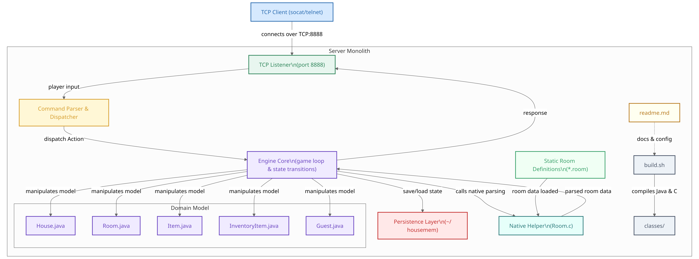

An ancient text-based game I wrote in college.

It stores data in `~/housemem`

Run a server with:

```bash
./build.sh
# (Which itself compiles w/ javac, so jave a JDK installed. Also depends on sed cpp & bash)
```

And connect with

```bash
socat - TCP:$YOUR_IP_ADDRESS:8888
```

And because 2025+ likes AI-generated everything and I'm only half an artist, here's a cool graph.


